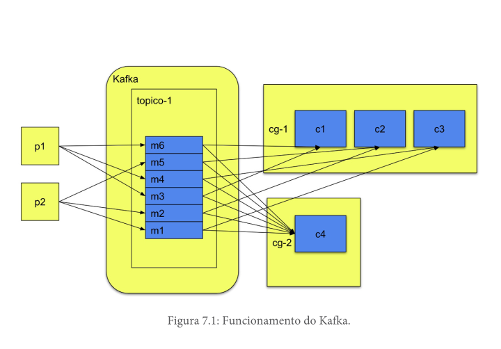

# Diferente Grupos de consumidores

De forma simplificada, quando adicionamos consumidores no mesmo grupo, queremos realizar o balanceamento de carga entre os consumidores. Quando criamos consumidores em grupos diferentes, queremos que cada grupo receba todas as mensagens do tópico e faça o processamento de forma independente.
O Kafka permite a criação de diferentes grupos de consumidores, cada um desses grupos pode ler todas as mensagens de um mesmo tópico, independentemente do que é feito em outros grupos.

## Consumer groups

É a ferramenta utilizada pelo Kafka para balancear e distribuir as mensagens de um tópico entre diferentes consumidores.
O Kafka tenta sempre balancear o número de mensagens enviadas para consumidores de um mesmo grupo.
Consumidores de diferentes grupos leem as mensagens independentemente dos outros grupos, isto é, as mesmas mensagens serão enviadas para todos os grupos.

## Particionamento

Quando uma mensagem chegar a um tópico, ela será alocada em uma partição do tópico, e apenas um consumidor de um grupo pode estar conectado a uma partição por vez. É com esse mecanismo que o Kafka evita que mais de um consumidor de um grupo leia a mesma mensagem.
