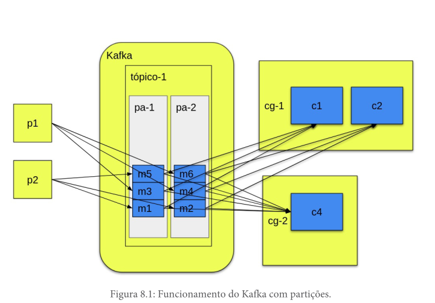

# Paralizando Tarefas

Cada tópico do Kafka tem uma ou mais partições, e cada consumidor se conecta a uma ou mais particições.

Em outras palavras, uma partição tem um relacionamento 1:1 com um consumidor de um grupo, porém um mesmo consumidor pode se conectar a várias partições.

por exemplo se tivemos 4 partições e 2 consumidores, o Kafka vai distribuir as partições entre os consumidores, ou seja, cada consumidor vai ficar com 2 partições.

A particição é o principal mecanismo para possibilitar a distribuição das mensagens entre os consumidores de um mesmo grupo,



> Como o tópico possui apenas duas partições, não adiantaria ter mais consumidores, que eles ficariam ociosos. Note também que as partições não mudam em nada o funcionamento
dos produtores, pois quem decidirá em qual partição uma mensagem será alocada é o Kafka, tornando o processo totalmente transparente para os produtores

## Partições pontos importantes

1. As mensagens não possuem ordem definida para serem consumidas em tópicos com mais de uma partição. Se ordem for importante ou usa apenas uma unica partição ou utiliza o conceito de chave de partição.

2. Cada partição téra apenas um consumidor recebendo a mensagem, ou seja, não é possível ter mais de um consumidor lendo a mesma partição. Por isso não deve existir mais consumidores do que partições disponíveis, senão os consumidores a mais ficarão ociosos.

## Offsets

o Offsets é o index interno do kafka, ele é o responsável por identificar a posição de uma mensagem dentro de uma partição. é assim que é definido qual mensagem será lida por um consumidor.

## Balanceamento de carga

o kafka sempre faz o balanceamento de carga entre os consumidores,

Se temos um tópico com 3 partições e inicialmente temos apenas um consumidor em um
grupo para esse tópico, as 3 partições serão alocadas para esse consumidor.

### Motivos para o balanceamento de carga

1. quando um novo consumidor entra em um grupo
2. quando um consumidor é finalizado e avisa o Kafka que ele saiu do grupo
3. quando um consumidor para de responder por um longo tempo.


## Alterando o número de partições

A informação da quantidade de partição é adicinada no momento da criação do tópico, para alterar é necessario recriar o tópico.

### Deletando um tópico

``` bash

./bin/kafka-topics.sh \
--bootstrap-server localhost:9092 \
--delete \
--topic SHOP_TOPIC

```

### Criando um tópico

``` bash
/bin/kafka-topics.sh \
--create \
--bootstrap-server localhost:9092 \
--partitions 6 \
--topic SHOP_TOPIC

```

> Não existe um número certo de partições para criar, isso depende bastante da aplicação. Uma recomendação de vários utilizadores do Kafka é criar um tópico com o dobro de
partições do que o número esperado de consumidores, assim
temos espaço para aumentar o número de consumidores do
Kafka caso seja necessário.
